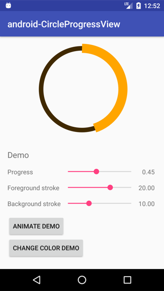

# CircleProgressView

CircleProgressView is a simple circle chart library for Android.



## Download

Gradle:

app's build.gradle

```groovy
compile 'jp.co.recruit_mp:android-CircleProgressView:1.0'
```

## Usage

Layout XML

```xml
<?xml version="1.0" encoding="utf-8"?>
<FrameLayout
    xmlns:android="http://schemas.android.com/apk/res/android"
    xmlns:app="http://schemas.android.com/apk/res-auto"
    android:layout_width="match_parent"
    android:layout_height="match_parent">

    <jp.co.recruit_mp.android.circleprogressview.CircleProgressView
        android:id="@+id/circleprogressview"
        android:layout_width="200dp"
        android:layout_height="200dp"
        android:layout_gravity="center_horizontal"
        android:layout_margin="16dp"
        app:CircleProgressView_progress="0.45"
        app:CircleProgressView_stroke="14dp"
        app:CircleProgressView_foregroundColor="@color/demo_orange"
        app:CircleProgressView_backgroundColor="@color/demo_brown"/>

</FrameLayout>
```

Java

```java
// Set progress
circleProgressView.setProgress(0.4f);
// Set stroke width
circleProgressView.setStrokeWidthPx(12);
// Set progress animation
circleProgressView.setProgressAnimation(1f, 1000);
// Set colors
circleProgressView.setForegroundColor(getResources().getColor(R.color.demo_orange));
circleProgressView.setBackgroundColor(getResources().getColor(R.color.demo_brown));
```

## License

```
Copyright (C) 2016 Recruit Marketing Partners Co.,Ltd

Licensed under the Apache License, Version 2.0 (the "License");
you may not use this file except in compliance with the License.
You may obtain a copy of the License at

http://www.apache.org/licenses/LICENSE-2.0

Unless required by applicable law or agreed to in writing, software
distributed under the License is distributed on an "AS IS" BASIS,
WITHOUT WARRANTIES OR CONDITIONS OF ANY KIND, either express or implied.
See the License for the specific language governing permissions and
limitations under the License.
```
